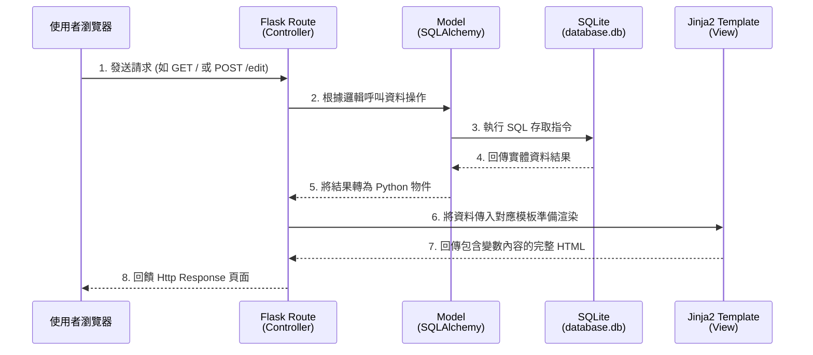

# 系統架構設計文件：讀書筆記本系統

## 1. 技術架構說明
本專案為簡化的 Web 應用程式，由後端框架統一處理邏輯與畫面呈現，不區分前後端分離：
* **選用技術與原因**：
  * **後端 - Python + Flask**：輕量級框架，適合快速建置原型或中小型專案，具備高度彈性與豐富社群支援。
  * **模板 - Jinja2**：Flask 內建的 HTML 模板渲染引擎，能將 Python 變數傳送到前端介面並具備 XSS 自動跳脫防禦機制。
  * **資料庫 - SQLite**：輕量化的檔案型資料庫，無須額外管理伺服器，對個人型應用效能綽綽有餘。

* **Flask MVC 模式說明**：
  * **Model (資料模型)**：負責定義物件與資料表結構，與 SQLite 溝通，處理「CRUD（新增、查詢、更新、刪除）」。
  * **View (視圖)**：以 Jinja2 動態渲染為核心的 HTML/CSS 模板，將從後端傳遞過來的變數轉化為視覺介面供使用者操作與閱讀。
  * **Controller (控制器)**：由 Flask 的路由函式（Router）擔綱，負責接收從瀏覽器來的 Request，呼叫對應的 Model 修改或調閱資料，接著交派 Jinja2 渲染 HTML 回傳給瀏覽器。

## 2. 專案資料夾結構

以下為推薦的架構配置及用途說明：

```text
web_app_development/
├── app/                      ← 應用程式主目錄 (MVC 核心)
│   ├── __init__.py           ← 初始化 Flask App 物件與各式擴展
│   ├── models.py             ← 定義書籍實體及資料表欄位 (Model)
│   ├── routes.py             ← 定義所有的端點邏輯與網址路徑 (Controller)
│   ├── templates/            ← 儲存供渲染的 HTML (View)
│   │   ├── base.html         ← 共用版面佈局 (導覽列、頁尾)
│   │   ├── index.html        ← 首頁：書籍總覽與搜尋列
│   │   ├── add.html          ← 新增書籍表單頁面
│   │   └── edit.html         ← 編輯書籍表單頁面
│   └── static/               ← 靜態資源 (CSS、JS與圖片)
│       └── css/
│           └── style.css     ← 自定義外觀樣式
├── instance/                 ← 不上傳版本控制的開發/運行檔案
│   └── database.db           ← SQLite 實體資料庫存檔位置
├── docs/                     ← 專案歷史與規劃文件
│   ├── PRD.md
│   └── ARCHITECTURE.md       ← 本文件
├── requirements.txt          ← 專案 Python 相依套件設定檔
└── app.py                    ← 啟動 Flask 開發伺服器的入口點
```

## 3. 元件關係圖

以下展示各元件處理一個請求的完整流程：



## 4. 關鍵設計決策

1. **以 Flask-SQLAlchemy 取代原生 SQLite3 查詢**
   * **原因**：雖然 PRD 指出 SQLite 可以直接連接處理，但考量安全性防護要求（SQL 注入攻擊的防止）、開發體驗以及未來如果需擴展修改資料庫的彈性，導入 ORM 工具是最佳實踐。
2. **採用 Server-Side Rendering (SSR)**
   * **原因**：本系統以紀錄、查閱為核心，操作多為簡單的表單提交流程且著重開發效率。不將畫面抽離為 React/Vue SPA 能省去維護 REST API 與多一個前端專案的複雜度，利用 Jinja2 渲染已經能提供很好的體驗。
3. **分離 `app.py` 啟動點核心與 `app/` 目錄**
   * **原因**：大型或擴展性強的 Flask 專案習慣採用 Application Factory 模式，將建構與註冊抽離到 `app/__init__.py`，使 `app.py` 只做最簡單的伺服器啟動指令，這樣的作法讓日後若要寫單元測試或抽換資料庫連線都能無痛升級，保持目錄職責獨立。
